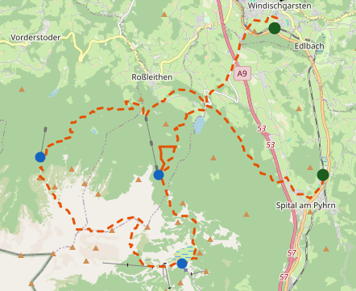

# Backlog

Cross-cutting data/pipeline problems that don't belong to one spec. Short summaries only — full
explanation, evidence and pointers live in the dedicated file under `docs/backlog/`. Newest-highest-
priority first within each section. An item graduates out of here when it gets its own spec or plan
under `docs/superpowers/`.

## High

bugs?

## Medium

### [Hut catalog gaps — privately-run mountain inns](backlog/hut-catalog-privately-run-inns.md)

Real overnight stops on tours (e.g. the Weinbergerhaus Berggasthof) are neither Alpine Club huts nor
Bergsteigerdörfer partner businesses, so they're absent from every hub layer.

### Make legs of selected tour hoverable

Atm the legs of the selected tour in the frontend are displayed but are not hoverable. Height profile should be displayed somewhere, making it more interactive

### Stable hut ids

At the moment hut ids are sequential, not stable

### Strucute data/ folder

At the moment the data/ folder is quite a mess. Lets enforce more structure onto it.

### Refactor frontend code

Atm code is quite unstructured not skill-checked with improve codebase architecture

## Low

### Settle invariant: official/third-party tours - dont ship gap legs

At the moment the third-party/official/folder-ingestion part of the pipeline emits a document that contains gap legs. Should be reported in the data quality layer, not shipped to frontend

### GPX Tool

A small webpage that helps bring GPX tours into a format the pipeline can ingest. Should support: Extending legs to a proper end (dont end on a mountain like Chiemgautour), slicing into legs, as some Tours are one big tour, not split into legs. So needs huts overlay, quality of life features.

### Idea: Introduce a pipeline explanation/visualization

Probably in form of a static web page, either as part of the existing frontend or a new one. May be combined with the data quality monitoring layer.

### Idea: Introduce a data quality monitoring layer

Simplest would be output files in a dedicated folder that collect monitoring data about our data. More sophisticated be something like a proper dashboard.