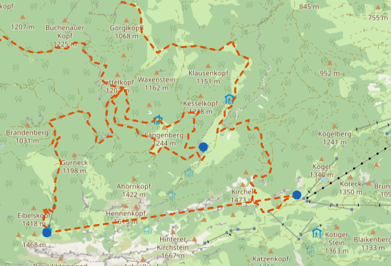
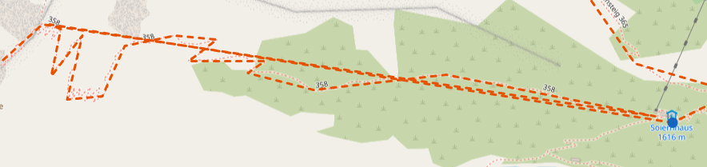
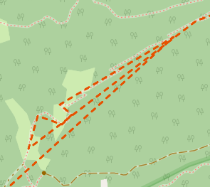
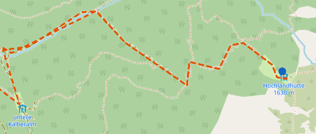
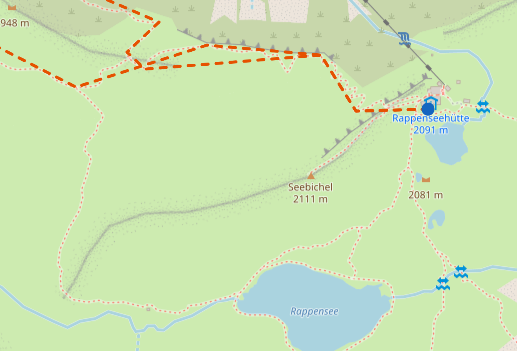

# Backlog

Cross-cutting data/pipeline problems that don't belong to one spec. Short summaries only — full
explanation, evidence and pointers live in the dedicated file under `docs/backlog/`. Newest-highest-
priority first within each section. An item graduates out of here when it gets its own spec or plan
under `docs/superpowers/`.

## High

### [Approach table drops a reserved source-type slot](backlog/approach-reserved-type-slot-overwrite.md)

`select_approaches` writes every reserved source-type slot into `selected[-1]`, so when two types
are missing from the top-k the second clobbers the first — 160 of 613 huts with candidates (26%)
lose an available source type on the 2026-09-02 run.

ui issue or pipeline bug?

unnecessary hut-to-hut edge retracing. Why doesnt alg find better non-overlapping solution?

## Medium

### [Approach selection doesn't penalize long walks through urban/street terrain](backlog/approach-urban-walk-unpenalized.md)

`select_approaches` ranks purely by DIN duration — a bus-station approach with 2h of city-street
walking before the real trailhead ranks identically to a true trailhead of the same duration. No
layer (pipeline or frontend) carries any surface/highway/urban signal today.

### [Hut catalog gaps — privately-run mountain inns](backlog/hut-catalog-privately-run-inns.md)

Real overnight stops on tours (e.g. the Weinbergerhaus Berggasthof) are neither Alpine Club huts nor
Bergsteigerdörfer partner businesses, so they're absent from every hub layer.

### Extend overlap avoidance to approach/exit legs

The 2026-08-29 overlap-avoidance work (`docs/superpowers/specs/2026-08-29-avoid-overlapping-tracks-design.md`)
only covers hut-to-hut legs. Approach legs (start point → first hut) and exit legs (last hut →
start point) carry their own `base_edge_id`s but are never checked against `usedEdgeIds` in
`search.ts`, so a suggested tour can still walk in or out over a trail segment another leg in the
chain already used. Needs the same edge-id treatment threaded through the start-edges data (flagged
as a 147 MB-class sidecar problem to solve first in the original design's "Out of scope" section).

### Make legs of selected tour hoverable

Atm the legs of the selected tour in the frontend are displayed but are not hoverable. Height profile should be displayed somewhere, making it more interactive

### No point-by-point elevation profile for approach/exit legs

Hut-to-hut legs carry a point-by-point `elevation_profile` in `hut-edge-stats.json`, but
`start-edge-stats.json` (the equivalent for approach/exit legs) is deliberately excluded from
`PUBLIC_FILES` (654 MB, no consumer per `docs/superpowers/specs/2026-08-27-tour-geometry-design.md`),
and `start_edges/records.npy` doesn't carry the profile at all today. So a tour's first and last leg
can never get a height-profile chart, only aggregate `ascent_m`/`descent_m`. Needs a pipeline change
to compute/emit a simplified, byte-range-fetchable elevation profile for `start_edges` (mirroring the
`hut-edge-geometry.bin` approach for lon/lat, not a 654 MB inline JSON blob), before "make legs
hoverable" above can cover the whole tour instead of just the hut-to-hut middle.
In general we want to ensure hut-to-hut and access legs to be treated as similarly as possible and
to share as much code as possible.

### Stable hut ids

At the moment hut ids are sequential, not stable

### Strucute data/ folder

At the moment the data/ folder is quite a mess. Lets enforce more structure onto it.
resume data-orga

### Refactor frontend code

Atm code is quite unstructured not skill-checked with improve codebase architecture

## Low

### [Frontend disclaimer for via_ferrata / high-SAC-grade legs](backlog/steep-terrain-time-disclaimer.md)

Once the steep-terrain time model spec lands, legs touching via_ferrata/T5-T6 terrain should warn
that the time estimate is approximate — no pipeline change needed, `sac_rank`/`via_ferrata` are
already in the edge payload.

### [Exact approach selection via a scalars-only path walk](backlog/exact-approach-selection-scalars-only-path-walk.md)

Drops `accumulate_path`'s coordinate accumulation to get true ascent/descent in the distance pass,
making approach selection exactly equal to today's instead of a top-20 over-selection. Only
actionable after the hub-edge scaling spec's §A+§B land.

### Include Aerial lift in access nodes?

Explore if it would make sense to include aerial lifts in access nodes or as routable way. Nice to have for a later point

### Settle invariant: official/third-party tours - dont ship gap legs

At the moment the third-party/official/folder-ingestion part of the pipeline emits a document that contains gap legs. Should be reported in the data quality layer, not shipped to frontend

### GPX Tool

A small webpage that helps bring GPX tours into a format the pipeline can ingest. Should support: Extending legs to a proper end (dont end on a mountain like Chiemgautour), slicing into legs, as some Tours are one big tour, not split into legs. So needs huts overlay, quality of life features.

### Idea: Introduce a pipeline explanation/visualization

Probably in form of a static web page, either as part of the existing frontend or a new one. May be combined with the data quality monitoring layer.

### Pipeline config file restructure

There are some hard to understand entries in the current config file. Maybe we can simplify it or also orga by phase.

### Quality issues

Snapshot from `data/quality/graph_building.json`, generated 14:15 local on 2026-09-03 — **after** the
igraph vertex-scrambling fix (`9eb5b90`), the elevation-sentinel fix (`88b08aa`), and a full
`build_hub_edges`/`build_access_edges`/`match_tour_edges` rebuild, so it reflects both. Confirmed
fixed by this run: `range_cap_hut_edges`/`range_cap_start_edges` (both 0) and
`scalar_sanity_hut_edges`/`scalar_sanity_start_edges` (both 0) — both now-removed backlog items,
resolved. `vertex_gap_hut_edges`/`self_retrace_hut_edges`/`vertex_gap_start_edges`/`self_retrace_start_edges`
dropped sharply but did not reach 0 — see
[hut-edge-geometry-drops-trail-detail](backlog/hut-edge-geometry-drops-trail-detail.md) for the
residual. `snap_health` and `connectivity` are untouched by either fix, as expected.

  Over baseline — worth attention:

  ┌────────────────────────────┬─────────┬──────────┬─────────────────────────────────────────────────────────────────────────────────────────────────────────────────────────────────────────┐
  │            Check           │ Flagged │ Baseline │                                                                  Note                                                                   │
  ├────────────────────────────┼─────────┼──────────┼─────────────────────────────────────────────────────────────────────────────────────────────────────────────────────────────────────────┤
  │ vertex_gap_start_edges     │ 5,719   │ 0        │ down from 122,794 pre-rebuild; baseline=0 for start_edges is a never-calibrated placeholder, not a real prior measurement                │
  ├────────────────────────────┼─────────┼──────────┼─────────────────────────────────────────────────────────────────────────────────────────────────────────────────────────────────────────┤
  │ self_retrace_start_edges   │ 219     │ 0        │ down from 15,477 pre-rebuild; same baseline caveat                                                                                        │
  ├────────────────────────────┼─────────┼──────────┼─────────────────────────────────────────────────────────────────────────────────────────────────────────────────────────────────────────┤
  │ vertex_gap_base_graph      │ 3,389   │ 0        │ unchanged — base_graph also defaults to baseline 0 in code, untouched by either fix                                                       │
  ├────────────────────────────┼─────────┼──────────┼─────────────────────────────────────────────────────────────────────────────────────────────────────────────────────────────────────────┤
  │ snap_health                │ 609     │ 225      │ unchanged, real regression +384. All sampled flags are hut snap issues with reason vertical_offset                                        │
  ├────────────────────────────┼─────────┼──────────┼─────────────────────────────────────────────────────────────────────────────────────────────────────────────────────────────────────────┤
  │ connectivity               │ 4       │ 0        │ unchanged — one row per route variant (FAST_ANY/T2/T3/T3_UNGRADED), each showing large isolated-hut counts (81–294 huts outside the       │
  │                            │         │          │ largest component)                                                                                                                         │
  ├────────────────────────────┼─────────┼──────────┼─────────────────────────────────────────────────────────────────────────────────────────────────────────────────────────────────────────┤
  │ vertex_gap_tour_edges      │ 1       │ 0        │ unchanged — 1 of 5 official-tour edges checked, a Kaisertour segment gap                                                                  │
  ├────────────────────────────┼─────────┼──────────┼─────────────────────────────────────────────────────────────────────────────────────────────────────────────────────────────────────────┤
  │ self_retrace_tour_edges    │ 1       │ 0        │ unchanged — 1 of 5, edge 259→796                                                                                                           │
  └────────────────────────────┴─────────┴──────────┴─────────────────────────────────────────────────────────────────────────────────────────────────────────────────────────────────────────┘

  Now at or below baseline (previously over): `vertex_gap_hut_edges` 120 vs. 700,
  `self_retrace_hut_edges` 9 vs. 270, `scalar_sanity_hut_edges` 0 vs. 24, `scalar_sanity_start_edges`
  0 vs. 82,017, `range_cap_hut_edges` 0 vs. 25, `range_cap_start_edges` 0 vs. 100,592.