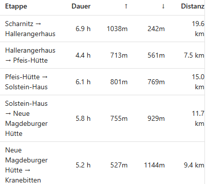

# Backlog

Cross-cutting data/pipeline problems that don't belong to one spec. Short summaries only — full
explanation, evidence and pointers live in the dedicated file under `docs/backlog/`. Newest-highest-
priority first within each section. An item graduates out of here when it gets its own spec or plan
under `docs/superpowers/`.

## High

### [start_edges ignores the max-edge range cap](backlog/start-edges-range-cap-violation.md)

100,592 of 471,196 `start_edges` rows (21%) exceed `graph.maxEdgeKm`, up to 267,637 m with 12,903 m
of ascent — routed paths with real geometry, shipped into the approach table's reverse index.

### [Routed edge geometry drops trail detail](backlog/hut-edge-geometry-drops-trail-detail.md)

1,438 straight hops over 500 m (worst 3,929 m) across 700 of 8,238 `hut_edges` records, none of
them at an endpoint. Base graph, subgraph cache and mid-chain snaps are all ruled out.

### [Approach table drops a reserved source-type slot](backlog/approach-reserved-type-slot-overwrite.md)

`select_approaches` writes every reserved source-type slot into `selected[-1]`, so when two types
are missing from the top-k the second clobbers the first — 160 of 613 huts with candidates (26%)
lose an available source type on the 2026-09-02 run.

bugs? Some of this should be solved by rerunning the pipeline with the duplication avoidance

## Medium

### [Degenerate zero-length start_edges rows](backlog/degenerate-zero-length-start-edges.md)

82,017 rows (17%) carry `max_ele_m == 0`; all are sub-166 m snap-coincident legs whose unset
maximum elevation is written as sea level into the column the client's altitude cap reads.

### [Base-graph time_s has a nonsense tail](backlog/base-graph-time-s-outliers.md)

1,011 edges imply under 0.05 m/s, 20 exceed a year, worst 2.95e12 s for a flat 118 m edge — silent
barriers that also poison the key `select_approach_pairs.py` ranks on.

### [Hut catalog gaps — privately-run mountain inns](backlog/hut-catalog-privately-run-inns.md)

Real overnight stops on tours (e.g. the Weinbergerhaus Berggasthof) are neither Alpine Club huts nor
Bergsteigerdörfer partner businesses, so they're absent from every hub layer.

### Make legs of selected tour hoverable

Atm the legs of the selected tour in the frontend are displayed but are not hoverable. Height profile should be displayed somewhere, making it more interactive

### Stable hut ids

At the moment hut ids are sequential, not stable

### Strucute data/ folder

At the moment the data/ folder is quite a mess. Lets enforce more structure onto it.

### Refactor frontend code

Atm code is quite unstructured not skill-checked with improve codebase architecture

## Low

### [Exact approach selection via a scalars-only path walk](backlog/exact-approach-selection-scalars-only-path-walk.md)

Drops `accumulate_path`'s coordinate accumulation to get true ascent/descent in the distance pass,
making approach selection exactly equal to today's instead of a top-20 over-selection. Only
actionable after the hub-edge scaling spec's §A+§B land.

### Include Aerial lift in access nodes?

Explore if it would make sense to include aerial lifts in access nodes or as routable way. Nice to have for a later point

### Settle invariant: official/third-party tours - dont ship gap legs

At the moment the third-party/official/folder-ingestion part of the pipeline emits a document that contains gap legs. Should be reported in the data quality layer, not shipped to frontend

### GPX Tool

A small webpage that helps bring GPX tours into a format the pipeline can ingest. Should support: Extending legs to a proper end (dont end on a mountain like Chiemgautour), slicing into legs, as some Tours are one big tour, not split into legs. So needs huts overlay, quality of life features.

### Idea: Introduce a pipeline explanation/visualization

Probably in form of a static web page, either as part of the existing frontend or a new one. May be combined with the data quality monitoring layer.

### Idea: Introduce a data quality monitoring layer

Simplest would be output files in a dedicated folder that collect monitoring data about our data. More sophisticated be something like a proper dashboard.